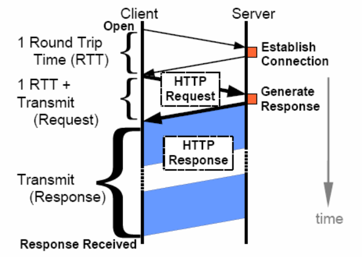
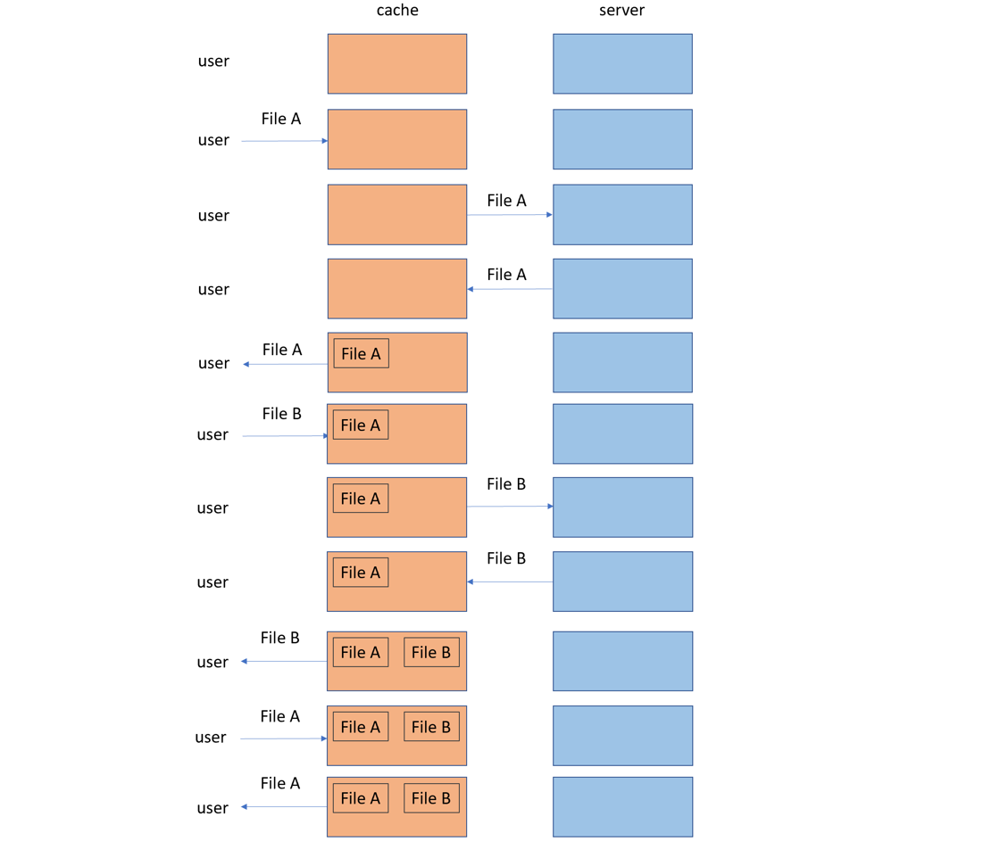

# Week 1

  

## Welcome to 711

1. lecture professor: Xinfeng Ye

2. Room: 303-589

3. Email: xinfeng@cs.auckland.ac.nz

  

## Grade

1. Assignment1: 15% - C# and Socket programming

2. Assignment2: 15% - C#

3. Final Exam: 70%

  

## Steps on accessing a web site

1. P1
2. Explain P1: 
	- Establish Connection (创建连接) 
	- Generate Response (使生成相应)
3. The time for DNS server to resolve the web server’s name to IP address (if necessary).
	- Not shown in the diagram
	- DNS: The Domain Name System (DNS) is a hierarchical (分层的) and distributed naming system for , services, and other resources in the Internet or other Internet Protocol (IP) networks.
4. The time for the client to set up a TCP connection with the web server
5. The time for the request transmitted from the client to the web server
6. The time for the web server to *parse* (解析) the request and *generate* (生成) a web page
7. The time for the response transmitted from the *host to client*
	- The time when all the information are received by the client
8. The time for the client browser (浏览器) to render the page
	- Not shown in the diagram

## How to reduce the response time

1. Reduce the network latency (延迟) (i.e., transmission delay)
	- Place servers closer (更近) to the clients
		- Could be significant
2. Reduce the amount of information that have to be sent to the clients
	- Benefits the users that connect to the servers through low-bandwidth networks
	- For a given bandwidth, *less information* to be transmitted means *less time* is needed for transmission 
3. Reduce the load on the web server
	- Generate (生成) the response faster
4. How to achieve (实现) these?
	- Proxy (代理) server, caching (缓存) server
		- A proxy server normally caches web contents. But, web contents can be cached on other types of servers as well.

## Web Cache

1. A web cache usually sits (位于) between the web server and clients
	- Watches (观察) requests come by and saves copies (副本) of the responses (相应) for them.
	- When there is a coming request for the same URL resource, the web cache can retrieve (检索) the cached response and send it back to the client without asking for the web server to serve this request (服务这次响应) again
2. P2
	- When the first time, user ask File A. Cache do not have file A so request server. Server give File A to cache and then cache give File A to user. When next user ask File A. Cache have File A so cache direct send File A to user and not request server.

## Advantages of Web Caching

1. Reducing network latency 
	- There is a distance between clients (客户端) and web servers.
	- Caching web object locally can dramatically (显著) reduce transmitting latency

## Dictionary

## 3/3/2023
1. 