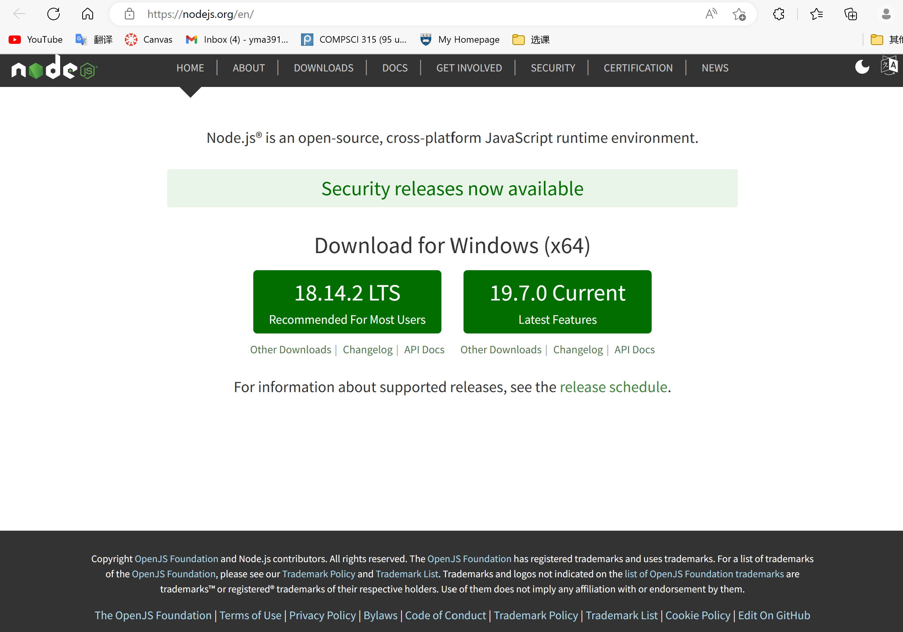
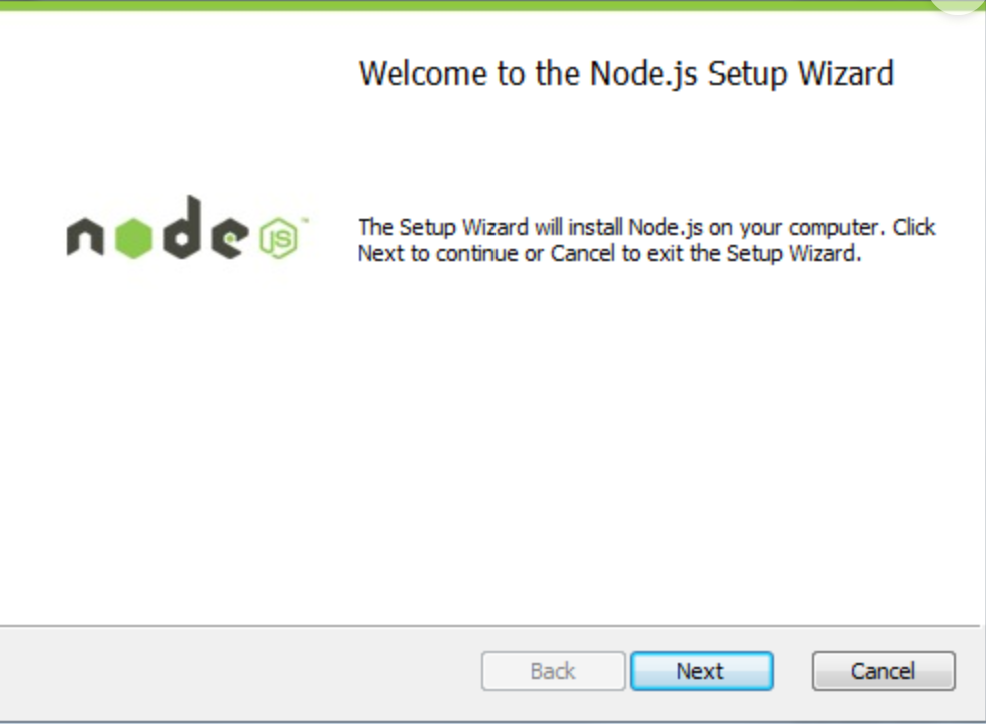
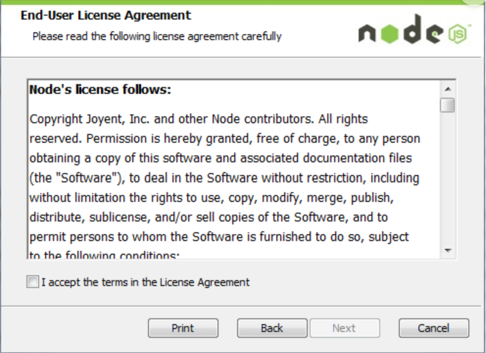
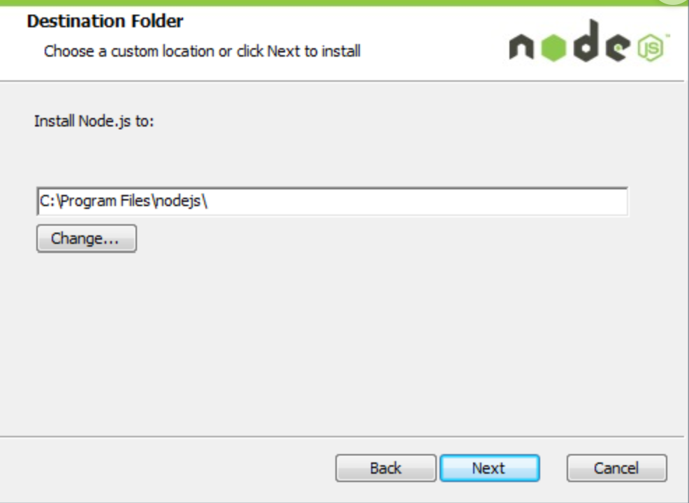
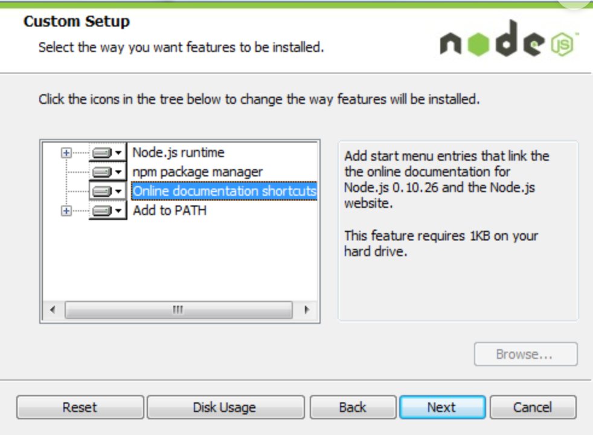
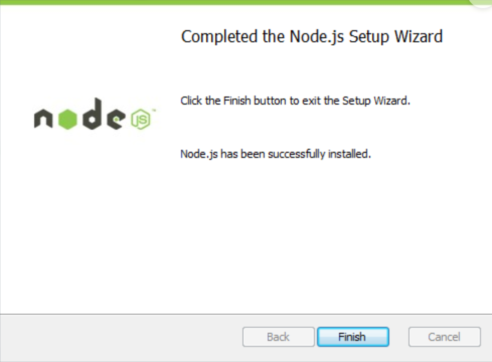

# download in the website
1. Address: https://nodejs.org/en/
2. P1
# Installation steps
1. P2
2. I accept the terms in the License Agreement (P3)
3. Choose your own directory (P4)
4. Choose Add to Path (P5)
5. Finish install (P6) 
[[Note-take]]