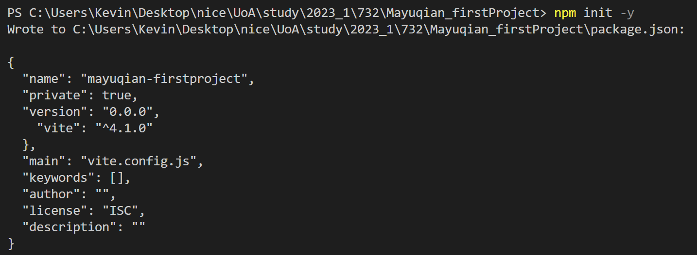
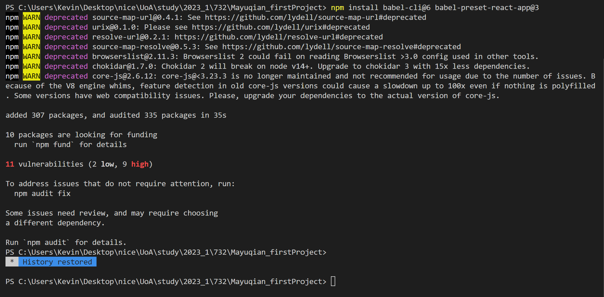
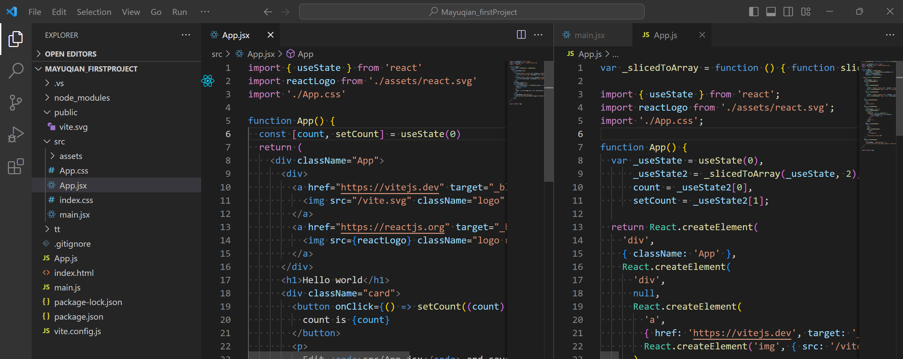
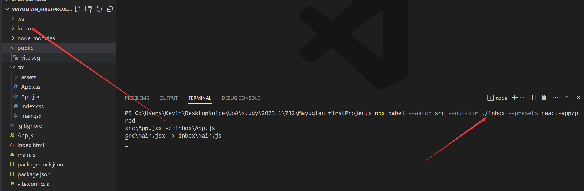

# Week1

## Babel - Setup and Usage
1. Make sure you have node.js / npm installed
	- If not you can see the [[Download]]]
2. install Babel in your Project folder using npm:
	- code
	```shell
	npm init -y 
	npm install babel-cli@6 babel-preset-react-app@3
	```
	- output P1
	- output P2
3. Create a Folder to store all your JS code (e.g. src)
4. Start the Babel pre-processor (预处理器)
	- code
	```shell
	npx babel --watch src --out-dir . --presets react-app/prod
	``` 
	- src: Start Babel and instructs (指示) it to watch all files here
	- "." When a file in the src directory changes a processed version will be created here
	- P3 
	- If we change "." to "./inbox"
	-  code
	```shell
	npx babel --watch src --out-dir ./inbox --presets react-app/prod
	``` 
	- P4 