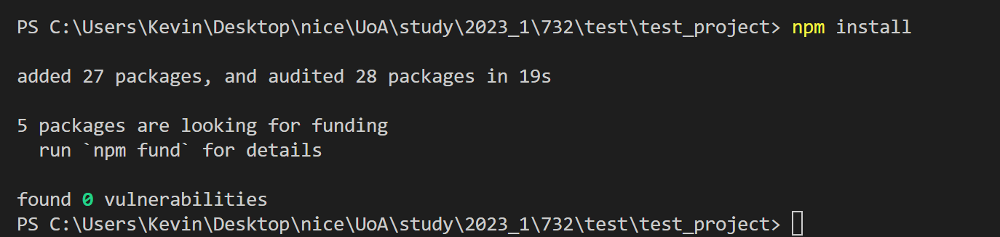

# Week1

## Babel - Setup and Usage

1. Make sure you have node.js / npm installed
	- If not you can see the [[Download]]]
2. install Babel in your Project folder using npm:
	- code
	```shell
	npm init -y 
	npm install babel-cli@6 babel-preset-react-app@3
	```
	- output P1
	- output P2
3. Create a Folder to store all your JS code (e.g. src)
4. Start the Babel pre-processor (预处理器)
	- code
	```shell
	npx babel --watch src --out-dir . --presets react-app/prod
	``` 
	- src: Start Babel and instructs (指示) it to watch all files here
	- "." When a file in the src directory changes a processed version will be created here
	- P3 
	- If we change "." to "./inbox"
	-  code
	```shell
	npx babel --watch src --out-dir ./inbox --presets react-app/prod
	``` 
	- P4 
5. Have your HTML file reference and generated file in a \<script\> tag - everything should work fine! You can check out the generated file in a text editor or view source in the browser to see what Babel produced (生成).

## React toolchains

1. Introduce: Vite is A fast, powerful, modern toolkit (工具包) for creating JavaScript-based frontends (前端) in a variety of frameworks
2. Key features:
	- Dependency resolution 
	- Hot module replacement 
	- TypeScript* 
	- CSS, PostCSS, CSS modules
3. To get started, simply run the following command, then follow the prompts:
4. Options: 
	- Project name: Your project will be created in a folder with this name (e.g. my-first-vite-project) 
	- Select a framework: You’ll probably be picking “React” here! 
	- Select a variant: JS or TypeScript, your choice (examples in this course use JS). SWC is an experimental FAST compiler – works really well in my testing (examples use this)
5. Project structure
	- public: Files in here can be directly navigated to by the browser 
	- src: Contains your source code and CSS. 
		- *.jsx / *.tsx: Your React code. Anything using JSX needs to be placed in a file with this extension (i.e. *.js or *.ts wont work if there’s any JSX code). 
		- main.jsx / main.tsx: Program entry point. 
	- .gitignore: Prevents certain unnecessary files from being added to your git repos. 
	- index.html: The “base” page for your app. React components will be “injected” into the “root” div. 
	- package.json: Contains project dependencies 
	- vite.config.js: Contains vite config. Probably don’t need to touch this (yet!)
6. code
	```shell
	npm create vite@latest
	```
7. P5 

## App development

1. Before you run for the first time, you need install dependencies
	- code
	```shell
	npm install
	```
	- Notice: You need move in your project folder and open the terminal and input the code
	- P6 
2. 

